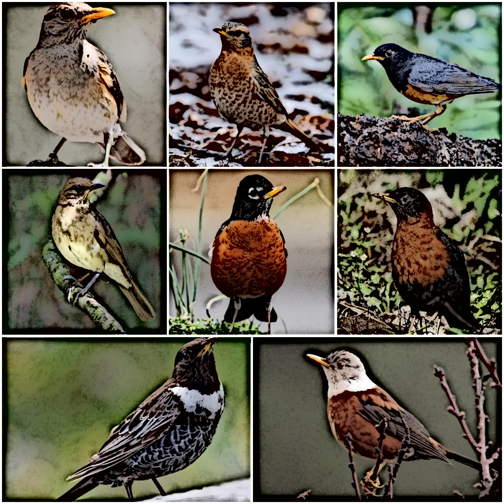

# Data and analyses for Turdus thrush dichromatism study


## Running Analyses
All data analysis is done using R 4.0.0. The environment can be replicated using a Docker container. 

1) Build the Docker container from the [Dockerfile](Dockerfile)
    + Open up a shell terminal and run ```bash docker_build.sh```
2) Run the Docker container
    + Run ```bash docker_rstudio.sh```
    + Open up a web browser and go to http://localhost:8787 (Linux) or http://{your IP address}:8787 (Mac or Windows)
3) Run R scripts from the ```R-Scripts``` directory in the order of their name (i.e., 01_data..., 02_analyze..., 03_...)

_DISCLAIMER: Geographic breeding range sympatry calculations, Bayesian multilevel regression models, k-fold information criterion model iterations and kfold IC model comparisons can only be done if they are run on a server with sufficient CPU and RAM specs (original run on server with 8 cores and 64Gb of RAM). **Results from these computations are saved and can be accessed in the ```Turdus_Data``` and ```Results``` directories.**_

## Directories
```.
├── Bash-Scripts
├── Data
│   └── Data_Copy_CSV
├── Figures
│   ├── Figure_Data
│   └── Posterior_Predictive_Fits
├── Phylogenies
├── Results
│   ├── model_kfold_IC
│   └── Model_Posterior_Draws
├── R-Scripts
└── Turdus_Data
    ├── turdus_birdlife_ranges
    ├── turdus_birdlife_ranges_gdb
    └── turdus_letsR_data
```